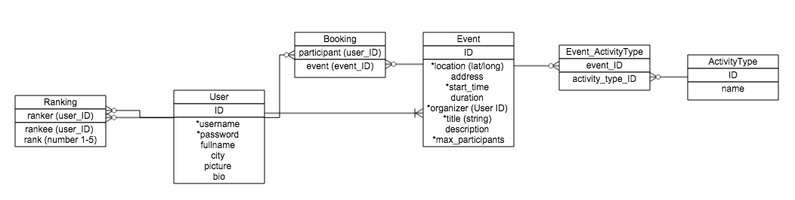

# FitHorde

[Trello page](https://trello.com/b/T6fRYGNk/fithorde-ga-project-2-khaled-and-michael)

[Notes in wiki](https://github.com/hyloguy/FitHorde/wiki)

Here is the schema diagram:

This README will document whatever steps are necessary to get the
application up and running.

Things you may want to cover:

* Ruby version: 2.1.2

* System dependencies

* Configuration

* Database creation

* Database initialization

* How to run the test suite

* Services (job queues, cache servers, search engines, etc.)

* Deployment instructions

* ...

Please feel free to use a different markup language if you do not plan to run
<tt>rake doc:app</tt>.
hello
